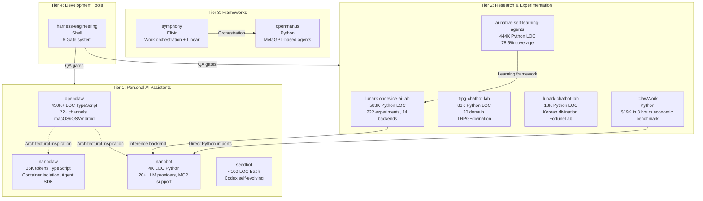

# AI-Native Agentic Ecosystem

> **Mission**: Building the next generation of AI-native personal assistants and self-learning agents through radical experimentation and production-grade engineering.

## CI Status

[](https://github.com/ai-native-agentic/ai-native-agentic/actions/workflows/test-all.yml)

Project badge references: [`.github/badges/README.md`](.github/badges/README.md)

**Organization**: [ai-native-agentic](https://github.com/ai-native-agentic)  
**Founded**: December 19, 2025  
**Founder**: JungSu Kim ([@zzragida](https://github.com/zzragida), NHN, South Korea)  
**Scale**: 12 repositories, ~1,130,000+ Python LOC, 4 production assistants, 5 research labs

## 📚 Documentation

**[Comprehensive Ecosystem Documentation](https://github.com/ai-native-agentic/documentation)** ⭐

Validation reports, integration roadmaps, and operational documentation:
- [VALIDATION_REPORT.md](https://github.com/ai-native-agentic/documentation/blob/main/VALIDATION_REPORT.md) - Complete 12-project validation (75% production-ready)
- [INTEGRATION_ROADMAP.md](https://github.com/ai-native-agentic/documentation/blob/main/INTEGRATION_ROADMAP.md) - Strategic integration plan
- [Installation & Test Reports](https://github.com/ai-native-agentic/documentation) - Full test coverage analysis

**Project-Specific Status**:
- Each repository has VALIDATION_STATUS.md with deployment readiness assessment

---

## 🏗️ Architecture: 5-Tier System



---

## 📦 Repository Inventory

### Tier 1: Personal AI Assistants (Production-Ready)

#### [openclaw](https://github.com/ai-native-agentic/openclaw) ⭐ Flagship
- **Purpose**: Full-featured AI personal assistant with 22+ messaging channels
- **Tech Stack**: TypeScript, 430K+ LOC
- **Platforms**: macOS, iOS, Android, Web
- **Channels**: Telegram, Discord, Slack, WhatsApp, SMS, Email, Twitter, LINE, Viber, Signal, Matrix, IRC, and more
- **Features**: Multi-LLM support (Claude, GPT-4, Gemini), context persistence, tool execution, scheduled tasks
- **Status**: Production-grade, active development

#### [nanoclaw](https://github.com/ai-native-agentic/nanoclaw)
- **Purpose**: Lightweight containerized AI assistant with security isolation
- **Tech Stack**: TypeScript, 35K tokens, Claude Agent SDK
- **Key Innovation**: Process-level isolation, sandboxed tool execution
- **Integration**: Built for Docker/Kubernetes deployment
- **Use Case**: Enterprise environments requiring security boundaries

#### [nanobot](https://github.com/ai-native-agentic/nanobot) 🚀 Ultra-lightweight
- **Purpose**: Minimalist AI assistant supporting 20+ LLM providers
- **Tech Stack**: Python 3.11+, 4K LOC
- **Providers**: OpenAI, Anthropic, Google, Ollama, Groq, Mistral, and more
- **MCP Support**: Native Model Context Protocol integration
- **Installation**: `pip install -e .`, config at `~/.nanobot/config.json`
- **Status**: Production-ready, actively maintained

#### [seedbot](https://github.com/ai-native-agentic/seedbot)
- **Purpose**: Self-evolving AI assistant powered by Codex
- **Tech Stack**: Bash, <100 LOC
- **Key Innovation**: Bot that modifies its own codebase based on user feedback
- **Philosophy**: Minimal viable agent that learns by doing
- **Status**: Experimental proof-of-concept

---

### Tier 2: Research & Experimentation (Labs)

#### [lunark-ondevice-ai-lab](https://github.com/ai-native-agentic/lunark-ondevice-ai-lab) 🔬 Massive Scale
- **Purpose**: Comprehensive on-device AI inference research
- **Scale**: 583K Python LOC, 222 experiments, 14 inference backends
- **Backends**: ONNX, TensorFlow Lite, Core ML, OpenVINO, TensorRT, ExecuTorch, LiteRT, MLC-LLM, llama.cpp, GGML, Candle, Burn, Tract, ncnn
- **Research Areas**:
  - Latency optimization (targeting <20ms)
  - Memory footprint reduction (50KB-10MB models)
  - Quantization techniques (INT8, INT4, FP16)
  - Mobile GPU acceleration (Metal, OpenCL, Vulkan)
  - Battery efficiency profiling
- **Mirror Source**: Lunark-AI-Dev organization
- **Status**: Active research, 80%+ test coverage requirement

#### [ai-native-self-learning-agents](https://github.com/ai-native-agentic/ai-native-self-learning-agents) 🧠 Self-Learning
- **Purpose**: Autonomous learning framework with intrinsic motivation
- **Scale**: 444K Python LOC, 78.5% test coverage
- **Key Innovations**:
  - Self-driven exploration without external rewards
  - Intrinsic motivation formula: `R_intrinsic = novelty × learning_progress`
  - Multi-stage curriculum: explore → practice → master → teach
  - Dynamic memory over static RAG
- **Academic Foundation**: "Autonomous Learning Through Self-Driven Exploration" (2026.01)
- **Mirror Source**: Lunark-AI-Dev organization
- **Status**: Research framework, production-ready components

#### [trpg-chatbot-lab](https://github.com/ai-native-agentic/trpg-chatbot-lab) 🎲 Multi-Domain
- **Purpose**: 20-domain TRPG + divination engine
- **Scale**: 83K Python LOC
- **Domains**: Fantasy, Sci-Fi, Horror, Modern, Historical, Cyberpunk, Steampunk, Post-Apocalyptic, Superhero, Detective, Romance, Comedy, Drama, Action, Adventure, Mystery, Thriller, Western, Noir, Lovecraftian
- **Divination**: Tarot (78 cards), I Ching (64 hexagrams), Runes (24 Elder Futhark), Astrology (12 signs), Numerology, Dream interpretation
- **Architecture**: Domain-specific LLM fine-tuning, context-aware storytelling
- **Mirror Source**: Lunark-AI-Dev organization
- **Status**: Active experimentation

#### [lunark-chatbot-lab](https://github.com/ai-native-agentic/lunark-chatbot-lab) 🔮 Korean Divination
- **Purpose**: Korean divination chatbot evaluation (FortuneLab)
- **Scale**: 18K Python LOC
- **Innovation**: **8-Axis Quality Rubric**
  1. Cultural Authenticity (traditional divination accuracy)
  2. Narrative Flow (story coherence)
  3. Personalization (user context adaptation)
  4. Emotional Resonance (empathy, comfort)
  5. Actionable Insight (practical guidance)
  6. Clarity (understandable explanations)
  7. Engagement (conversational quality)
  8. Safety (avoiding harmful advice)
- **Evaluation**: Automated + human-in-the-loop scoring
- **Mirror Source**: Lunark-AI-Dev organization
- **Status**: Production evaluation pipeline

#### [ClawWork](https://github.com/ai-native-agentic/ClawWork) 💰 Economic Benchmark
- **Purpose**: AI agent economic value measurement
- **Achievement**: $19,000 USD earned in 8 hours (real-world tasks)
- **Tech Stack**: Python, direct integration with nanobot
- **Dependency**: **ONLY cross-repo import in entire ecosystem** (`from nanobot import Agent`)
- **Task Categories**: Coding, writing, research, design, data analysis, customer support
- **Metrics**: Earnings per hour, task completion rate, quality score, user satisfaction
- **Philosophy**: AI value = economic output, not benchmarks
- **Status**: Active production use

---

### Tier 3: Frameworks

#### [openmanus](https://github.com/ai-native-agentic/openmanus)
- **Purpose**: MetaGPT-based multi-agent framework
- **Tech Stack**: Python
- **Capabilities**: Agent role definition, task delegation, communication protocols
- **Integration**: Designed for complex multi-agent workflows
- **Status**: Framework development

#### [symphony](https://github.com/ai-native-agentic/symphony)
- **Purpose**: Work orchestration with Linear issue tracking integration
- **Tech Stack**: Elixir
- **Features**: Distributed task execution, fault tolerance, real-time updates
- **Use Case**: Managing agent tasks across multiple repositories
- **Status**: Early development

---

### Tier 4: Development Tools

#### [harness-engineering](https://github.com/ai-native-agentic/harness-engineering) ✅ 6-Gate QA
- **Purpose**: Agent-driven development quality assurance
- **Tech Stack**: Shell scripts
- **6-Gate System**:
  1. **Syntax Gate**: Code compiles/parses
  2. **Type Gate**: Type checking passes
  3. **Lint Gate**: Style guidelines met
  4. **Test Gate**: Unit tests pass (70%+ coverage)
  5. **Integration Gate**: E2E tests pass
  6. **Security Gate**: Vulnerability scan clean
- **Philosophy**: "No gate skipping, no shortcuts"
- **Integration**: Used across all Tier 1 & Tier 2 projects
- **Status**: Production-ready tooling

---

## 🔗 Dependency Graph

### Strong Coupling (Direct Imports)
```
ClawWork → Nanobot
```
**Only direct cross-repository dependency in entire ecosystem.**

### Weak Coupling (Architectural Inspiration)
```
openclaw → {nanoclaw, nanobot}
```
**Design patterns shared, no code imports.**

### Independent (No Cross-Repo Dependencies)
```
All other repositories operate independently
```

---

## 🎯 Core Technical Patterns

### 1. Multi-Channel Messaging
**Repos**: openclaw, nanoclaw, nanobot  
**Pattern**: Unified interface for 20+ messaging platforms  
**Implementation**: Provider abstraction layer with channel-specific adapters

### 2. Multi-LLM Provider Support
**Repos**: openclaw, nanobot  
**Pattern**: 20+ LLM providers behind single API  
**Providers**: OpenAI, Anthropic, Google, Ollama, Groq, Mistral, DeepSeek, Cohere, AI21, Together, Replicate, and more

### 3. Container/Process Isolation
**Repos**: nanoclaw  
**Pattern**: Sandboxed tool execution for security  
**Use Case**: Enterprise deployments, untrusted code execution

### 4. Quality Measurement Frameworks
**Repos**: lunark-chatbot-lab (8-axis rubric), harness-engineering (6-Gate system)  
**Pattern**: Automated + human evaluation pipelines  
**Metrics**: Cultural authenticity, narrative flow, test coverage, security scan

### 5. Economic Value Tracking
**Repos**: ClawWork  
**Pattern**: Real-world task earnings as AI capability metric  
**Philosophy**: Move beyond benchmarks to actual economic output

---

## 🚀 Integration Opportunities

### 1. Shared Quality Library
**Goal**: Extract FortuneLab's 8-axis rubric into reusable package  
**Beneficiaries**: All chatbot projects (nanobot, nanoclaw, openclaw)  
**Effort**: 2-3 weeks  
**Impact**: Consistent quality measurement across ecosystem

### 2. Economic Tracking SDK
**Goal**: Extract ClawWork's earnings model into SDK  
**Beneficiaries**: Any agent that performs real-world tasks  
**Effort**: 1-2 weeks  
**Impact**: Unified economic value metrics

### 3. Channel Abstraction Layer
**Goal**: Unified multi-channel interface from openclaw  
**Beneficiaries**: nanobot, nanoclaw  
**Effort**: 3-4 weeks  
**Impact**: Any assistant supports 22+ channels instantly

### 4. Cross-Repo Evaluation Pipeline
**Goal**: Harness Engineering 6-Gate + FortuneLab 8-Axis integration  
**Beneficiaries**: All repositories  
**Effort**: 2 weeks  
**Impact**: 14-dimension quality assurance

### 5. Harness Engineering for All Agents
**Goal**: Apply 6-Gate system to all Tier 2 research projects  
**Current**: Only some projects use it  
**Effort**: 1 week per repo  
**Impact**: 70%+ test coverage, security compliance

### 6. Self-Learning from Economic Feedback
**Goal**: Connect ai-native-self-learning-agents to ClawWork earnings  
**Innovation**: Intrinsic motivation driven by economic value  
**Effort**: 4-6 weeks  
**Impact**: Agents optimize for real-world value, not proxy metrics

### 7. Multi-Agent Orchestra
**Goal**: Symphony orchestration + openmanus agents + Linear tracking  
**Use Case**: Complex multi-repo development tasks  
**Effort**: 6-8 weeks  
**Impact**: Agents collaborate across entire ecosystem

---

## 📊 Maturity Assessment

### Production-Ready (Ship Today)
- ✅ openclaw - 430K LOC, multi-platform, 22+ channels
- ✅ nanobot - 4K LOC, 20+ LLM providers, MCP support
- ✅ harness-engineering - 6-Gate QA system in active use
- ✅ lunark-chatbot-lab - FortuneLab evaluation pipeline

### Near-Production (1-2 months)
- ⚙️ nanoclaw - Container isolation stable, needs broader testing
- ⚙️ ClawWork - Economic model proven, needs SDK extraction

### Research Stage (3-6 months)
- 🔬 lunark-ondevice-ai-lab - 222 experiments, needs consolidation
- 🔬 ai-native-self-learning-agents - Framework ready, needs production integration
- 🔬 trpg-chatbot-lab - 20 domains implemented, needs evaluation pipeline

### Early Development (6+ months)
- 🌱 openmanus - MetaGPT integration in progress
- 🌱 symphony - Elixir orchestration framework started
- 🌱 seedbot - Proof-of-concept, needs safety mechanisms

---

## 🌐 2026 AI Trends (Librarian Research)

### 1. On-Device First
**Latency**: 20ms on-device vs 200-500ms cloud  
**Privacy**: Data never leaves device  
**Frameworks**: ExecuTorch (Meta, 50KB), LiteRT (Google, universal)  
**Ecosystem Alignment**: lunark-ondevice-ai-lab 14 backends

### 2. Self-Driven Exploration
**Formula**: `R_intrinsic = novelty × learning_progress`  
**Academic**: "Autonomous Learning Through Self-Driven Exploration" (2026.01)  
**Ecosystem Alignment**: ai-native-self-learning-agents

### 3. Production Observability
**Pattern**: Lunary.ai tracing, real-time monitoring  
**Need**: Move beyond post-hoc evaluation to live tracking  
**Ecosystem Gap**: No repository implements this yet

### 4. Dynamic Memory over Static RAG
**Innovation**: Agents build their own knowledge graphs  
**Problem**: RAG retrieves but doesn't learn  
**Ecosystem Alignment**: ai-native-self-learning-agents memory system

### 5. Economic Value Metrics
**Philosophy**: AI capability = economic output  
**Benchmark Limitation**: MMLU scores don't predict real-world value  
**Ecosystem Alignment**: ClawWork $19K benchmark

---

## 🛠️ Technology Stack Clusters

### TypeScript Cluster (2 repos)
- openclaw (430K LOC) - Full assistant
- nanoclaw (35K tokens) - Container isolation

### Python Cluster (7 repos)
- **Production**: nanobot (4K LOC), ClawWork
- **Research Labs**: lunark-ondevice-ai-lab (583K LOC), ai-native-self-learning-agents (444K LOC), trpg-chatbot-lab (83K LOC), lunark-chatbot-lab (18K LOC)
- **Framework**: openmanus

### Elixir Cluster (1 repo)
- symphony - Work orchestration

### Shell Cluster (2 repos)
- harness-engineering - 6-Gate QA
- seedbot - Self-evolving agent

---

## 📋 Quick Start

### Clone All Repositories
```bash
cd ~/projects/ai-native-agentic
gh repo clone ai-native-agentic/openclaw
gh repo clone ai-native-agentic/nanoclaw
gh repo clone ai-native-agentic/nanobot
gh repo clone ai-native-agentic/seedbot
gh repo clone ai-native-agentic/ClawWork
gh repo clone ai-native-agentic/openmanus
gh repo clone ai-native-agentic/symphony
gh repo clone ai-native-agentic/harness-engineering
gh repo clone ai-native-agentic/lunark-chatbot-lab
gh repo clone ai-native-agentic/ai-native-self-learning-agents
gh repo clone ai-native-agentic/lunark-ondevice-ai-lab
gh repo clone ai-native-agentic/trpg-chatbot-lab
```

### Try Nanobot (Fastest Path)
```bash
cd nanobot
pip install -e .  # Requires Python 3.11+
export ANTHROPIC_API_KEY="your-key-here"
nanobot agent -m "Hello from ai-native-agentic!"
```

### Configure NotebookLM MCP (Optional)
```bash
# Install NotebookLM MCP CLI
uv tool install notebooklm-mcp-cli

# Authenticate
export PATH="$HOME/.local/bin:$PATH"
nlm login

# Test integration
nanobot agent -m "내 NotebookLM 노트북 목록 보여줘"
```

---

## 🤝 Contributing

Each repository maintains its own AGENTS.md with contribution guidelines:
- **Test Coverage**: 70% minimum, 80% for new experiments
- **Logging**: Use `get_logger(__name__)`, never `print()`
- **6-Gate Compliance**: All PRs must pass harness-engineering gates
- **No Cross-Imports**: Except ClawWork→Nanobot, keep repos independent

---

## 📖 Documentation

- **Organization**: https://github.com/ai-native-agentic
- **Founder**: [@zzragida](https://github.com/zzragida)
- **Each Repo**: See individual README.md for detailed documentation
- **AGENTS.md**: Agent-specific contribution guidelines in each repo

---

## 📜 License

See individual repositories for license information.

---

## 🎯 Strategic Vision

**Short-term (3 months)**:
1. Extract shared libraries (Quality SDK, Economic Tracker, Channel Layer)
2. Implement 6-Gate QA across all research projects
3. Production-grade nanoclaw and ClawWork SDK

**Mid-term (6 months)**:
4. Self-learning agents with economic feedback loop
5. Multi-agent orchestra (Symphony + openmanus + Linear)
6. Production observability (Lunary.ai pattern)

**Long-term (12 months)**:
7. On-device inference at <20ms latency (ExecuTorch/LiteRT)
8. Unified assistant (openclaw + nanoclaw + nanobot = single codebase)
9. Open-source commercial platform (enterprise deployments)

---

**Last Updated**: March 7, 2026  
**Total Repositories**: 12  
**Total LOC**: ~1,130,000+ (Python), 430K+ (TypeScript)  
**Status**: Active development across all tiers
